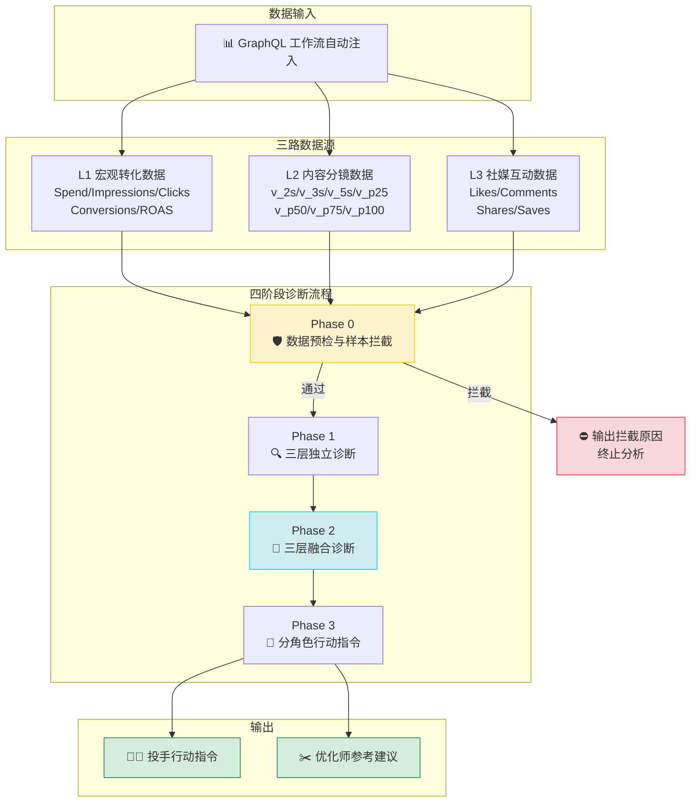
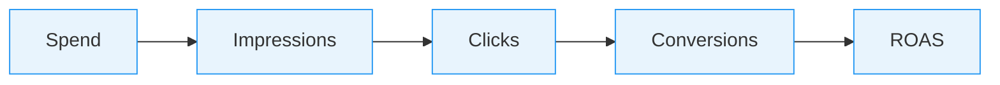
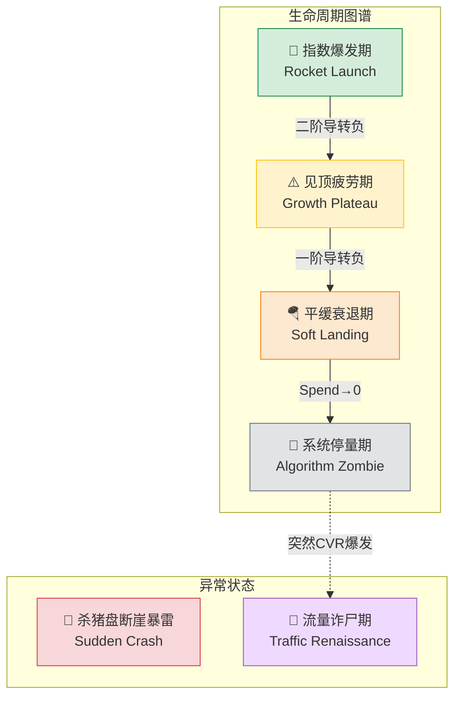
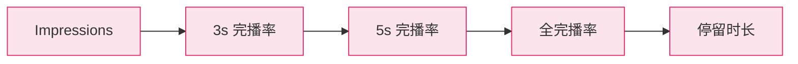
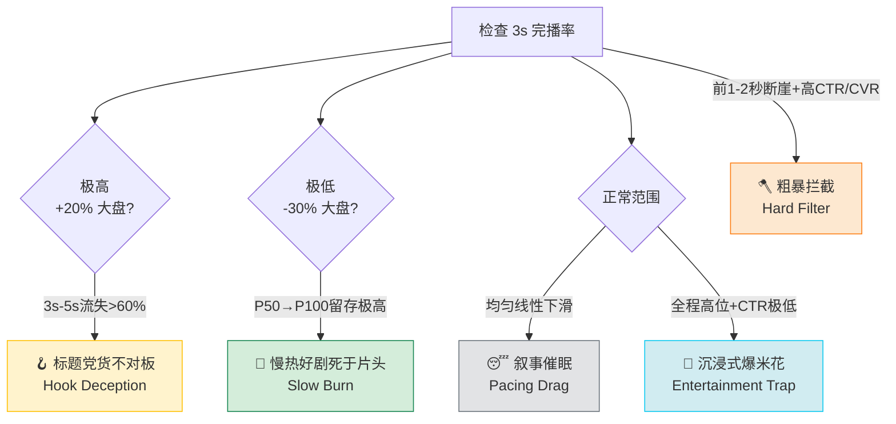
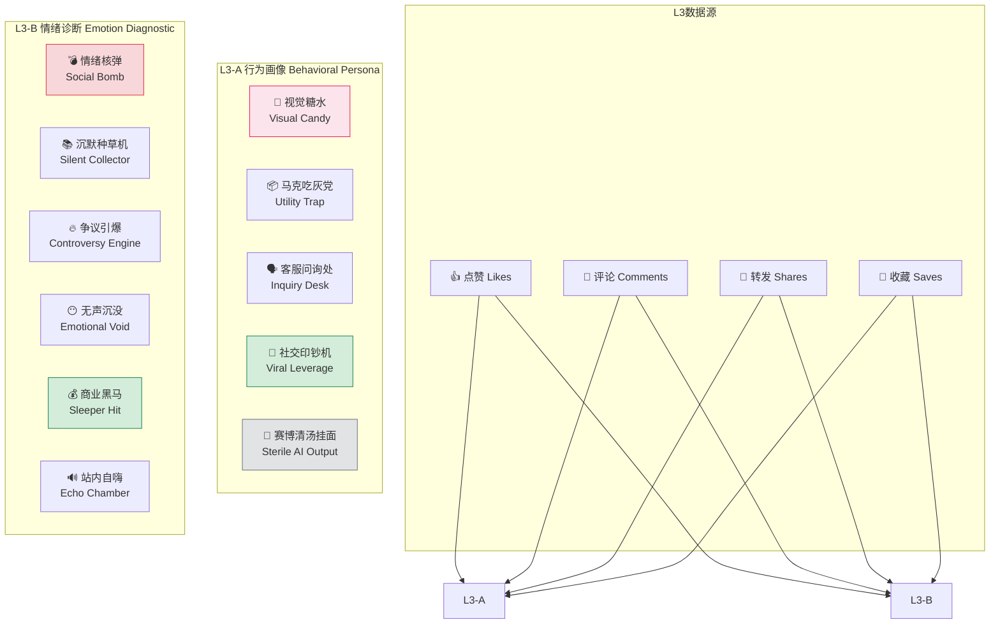
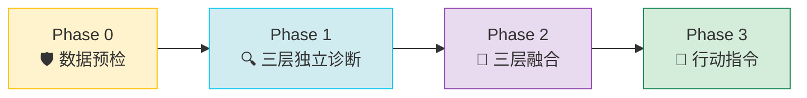
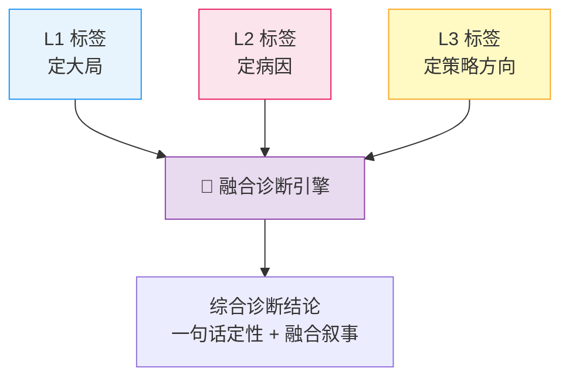
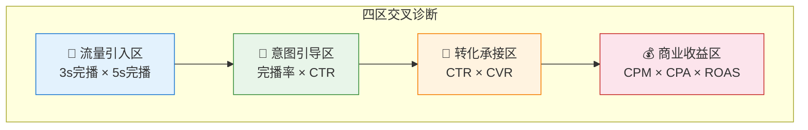

# 🔬 广告素材诊断引擎 (Ad Material Diagnostic Engine)

> 通过三路数据（宏观转化 / 内容分镜 / 社媒互动）对广告素材进行生命周期定位、内容质量诊断、情绪传播评估，输出融合三层诊断的综合结论与分角色行动指令。

---

## 📋 目录

- [核心架构](#-核心架构)
- [三层诊断体系](#-三层诊断体系)
  - [L1 宏观转化诊断](#l1-宏观转化诊断素材生命周期)
  - [L2 内容分镜诊断](#l2-内容分镜诊断视频内容质量)
  - [L3 情绪互动诊断](#l3-情绪互动诊断社交传播价值)
- [四阶段工作流](#-四阶段工作流)
- [诊断方法论](#-诊断方法论)
- [文件结构](#-文件结构)
- [使用场景](#-使用场景)

---

## 🏗 核心架构

整个引擎的设计哲学：**不输出"数据快照"，而是输出"产品生命周期图谱"。**



---

## 🏷 三层诊断体系

### L1 宏观转化诊断：素材生命周期

> 从转化漏斗视角定位素材当前处于生命周期的哪个阶段



通过 **静态指标阈值 + 动态导数特征** 双重判断，将素材定位到 6 个生命周期阶段：



| 标签 | 静态触发 | 动态导数 | 行动指令 |
|:-----|:--------|:--------|:--------|
| 🚨 **杀猪盘断崖暴雷** (Sudden Crash) | CTR 前10% + CVR 后10% + ROAS<0.8 | 一阶导<0, 二阶导<0 | **绝对止损**，无脑关停 |
| 🚀 **指数爆发期** (Rocket Launch) | Spend 激增 + ROAS>1.2 | 一阶导>0, 二阶导>0 | **火力全开**，严禁修改任何设置 |
| ⚠️ **见顶疲劳期** (Growth Plateau) | Spend 高位 + ROAS≈1.0 | 一阶导≥0, 二阶导<0 | **拉响警报**，生成变体素材接盘 |
| 🪂 **平缓衰退期** (Soft Landing) | Spend↓ + ROAS<1.0 | 一阶导<0, 二阶导>0 | **防守收割**，降CPA榨最后价值 |
| 🧟 **系统停量期** (Algorithm Zombie) | Spend≈0，提价无曝光 | 样本不足，增速=0 | **断舍离**，直接归档 |
| 🌸 **流量诈尸期** (Traffic Renaissance) | 历史低迷 + CVR突然爆发 | 一阶导突然跳跃>0 | **抢抓机遇**，新建复制计划吃红利 |

---

### L2 内容分镜诊断：视频内容质量

> 从内容留存漏斗视角诊断视频在哪个时间段出了什么问题



5 个内容诊断标签，每个对应不同的完播曲线形态：



| 标签 | 核心指标特征 | 优化师行动 |
|:-----|:-----------|:----------|
| 🪝 **标题党** (Hook Deception) | 3s极高 → 3s-5s断崖流失>60% | 保留Hook，重拍4-8秒承接段 |
| 💎 **慢热好剧** (Slow Burn) | 3s极低，但留下的人几乎全看完 | 抽取高潮画面前置到片头 |
| 😴 **叙事催眠** (Pacing Drag) | 5s→P50均匀线性下滑 | 每3-5秒加一个视觉刺激点 |
| 🍿 **沉浸式爆米花** (Entertainment Trap) | 完播极高但CTR极低 | P50+末尾3秒强制加商业指令 |
| 🪓 **粗暴拦截** (Hard Filter) | 完播极低但CTR/CVR极高 | **不要优化完播率！** 这是受众过滤器 |

---

### L3 情绪互动诊断：社交传播价值

> 从社交互动四维（赞/评/转/藏）评估素材的社交传播价值

L3 分为两个子层级：



#### L3-A 行为画像（5个）

| 标签 | L1+L2基础 + L3特征 | 行动指令 |
|:-----|:------------------|:--------|
| 🍬 **视觉糖水** | ROAS低+完播高+只有赞高 | 保留画面，重写配音为卖货风 |
| 📦 **马克吃灰党** | 消耗高+完播高+收藏极高 | 加入限时倒计时等逼单元素 |
| 🗣️ **客服问询处** | 完播一般+评论>5倍大盘 | AI爬取评论区，区分问价/槽点 |
| 💸 **社交印钞机** | ROAS惊人+转发量指数裂变 | 降价+无限放量，吃到红利消失 |
| 🤖 **赛博清汤挂面** | L1全面衰退+四维互动≈0 | 粉碎性销毁，方向性否定 |

#### L3-B 情绪诊断（6个）

| 标签 | 赞 | 评 | 转发 | 收藏 | 策略 |
|:-----|:---|:---|:-----|:-----|:-----|
| 💣 **情绪核弹** | 极高 | 极高 | **极高** | 中高 | 提炼为S级创意母模板 |
| 📚 **沉默种草机** | 中低 | 极低 | 极低 | **极高** | 配合Retargeting二次触达 |
| 🔥 **争议引爆** | 低/负 | **极高** | 中高 | 极低 | 审核区分良性/恶性争议 |
| 😶 **无声沉没** | 极低 | 极低 | 极低 | 极低 | 否定创意方向，回到选题 |
| 💰 **商业黑马** | 高 | 中 | 低 | 高 | 立刻全力放量，设为Champion组 |
| 🔊 **站内自嗨** | 极高 | 高 | **极低** | 低 | 锁定窄圈层，尝试降门槛变体 |

---

## ⚙ 四阶段工作流



### Phase 0：数据预检与样本拦截

在开始诊断前，检查数据有效性：

| 拦截条件 | 处理 |
|:--------|:-----|
| 3天消耗 < $200 或 单日 < $50 | 打标「数据样本量过小」，跳过二阶导数 |
| Impression < 1K | 打标「样本过少」，不做评价 |
| 当前值 > 大盘均值 × 1.5 | 极值宽容，忽略衰退加速度 |
| 一阶导<0 + 二阶导负且绝对值>阈值 + 头部20%消耗 + ROAS逼近P25 | 才打「断崖暴雷」|

### Phase 1：三层独立诊断（并行执行）

同时执行 L1 / L2 / L3 三条诊断链路，各自输出独立标签。

### Phase 2：三层融合诊断



**融合原则：**
- **L1 定大局**：决定素材的"生死状态"，最高优先级
- **L2 定病因**：找到内容层面的具体问题根因
- **L3 定策略方向**：决定行动偏向"传播"还是"转化"
- **矛盾信号**：优先信任 L1（基于真实转化数据），标注矛盾点

### Phase 3：分角色行动指令

输出按紧急程度排序的投手行动指令 + 优化师参考建议。

---

## 📐 诊断方法论

### 多指标交叉诊断



### 二阶导数时间维度分析

将时间（一阶斜率 + 二阶加速度）作为第四个维度，从"静态快照"升级为"动态生命周期图谱"：

```
静态看：系统只知道 ROI 在掉 → 投手："没关系，再观察一天"
动态看：系统发现加速度不对劲 → 结论："断崖暴雷，再等一天多亏5000块"
```

### 平滑降噪

使用 7 天滑动窗口（MA3/MA5）平滑周末效应、午夜效应等随机噪声，避免二阶导数放大噪声导致误报。

---

## 📁 文件结构

```
ad-material-diagnostic/
├── SKILL.md                                  # 主入口：角色/数据规范/工作流/融合/输出
├── README.md                                 # 本文件
└── references/
    ├── L1-lifecycle-stages.md                # L1：6个生命周期标签详细定义
    ├── L2-content-labels.md                  # L2：5个内容诊断标签详细定义
    ├── L3-engagement-labels.md               # L3：5行为画像+6情绪诊断标签详细定义
    ├── benchmark-and-thresholds.md           # Benchmark标准 + 样本拦截规则
    └── cross-diagnosis-methods.md            # 交叉诊断 + 二阶导数 + 降噪方法
```

| 文件 | 内容 | 何时读取 |
|:-----|:-----|:--------|
| `SKILL.md` | 主控逻辑与输出格式 | 每次诊断必读 |
| `L1-lifecycle-stages.md` | 6个 L1 标签的触发条件/根因/行动指令 | Phase 1 执行 L1 诊断时 |
| `L2-content-labels.md` | 5个 L2 标签的指标组合/决策树/剪辑指导 | Phase 1 执行 L2 诊断时 |
| `L3-engagement-labels.md` | 11个 L3 标签的四维指标/根因/运营策略 | Phase 1 执行 L3 诊断时 |
| `benchmark-and-thresholds.md` | 3类指标界定 + 4条拦截规则 | Phase 0 数据预检时 |
| `cross-diagnosis-methods.md` | 4区交叉诊断 + 导数分析 + 降噪 | Phase 2 辅助分析时 |

---

## 🎬 使用场景

| 场景 | 输入 | 输出 |
|:-----|:-----|:-----|
| **单素材快照分析** | 一条素材的当前指标 | 三层标签 + 融合结论 + 行动指令 |
| **素材生命周期判断** | 同一素材近7天时序数据 | 导数驱动的阶段定位 + 趋势预判 |
| **批量素材对比** | 多条素材的同期数据 | 按L1分组 + 组内排序 + 组级策略 |
| **内容质量诊断** | 秒级完播率数据 | L2标签 + 具体剪辑修改方案 |
| **社交传播评估** | 赞/评/转/藏互动数据 | L3行为画像 + 情绪诊断 + 运营策略 |

---

## 👥 Contributors

<table>
  <tr>
    <td align="center">
      <a href="https://github.com/BernaLiuDev">
        <br />
        <sub><b>Berna</b></sub>
      </a><br />
      <sub>🧠 需求设计 · 📐 诊断框架 · 📊 业务逻辑</sub>
    </td>
    <td align="center">
      <a href="https://claude.ai">
        <br />
        <sub><b>Claude Opus 4.6</b></sub>
      </a><br />
      <sub>💻 Skill 编写 · 🏗 架构实现 · 📝 文档生成</sub>
    </td>
  </tr>
</table>

> 本项目由 **Berna** 提供核心业务方法论与诊断框架设计，**Claude** 负责 Skill 代码编写与文档架构实现，双方协作完成。

---

## 📄 License

MIT License
